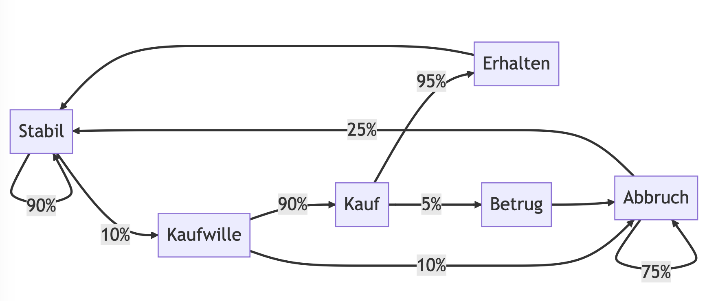
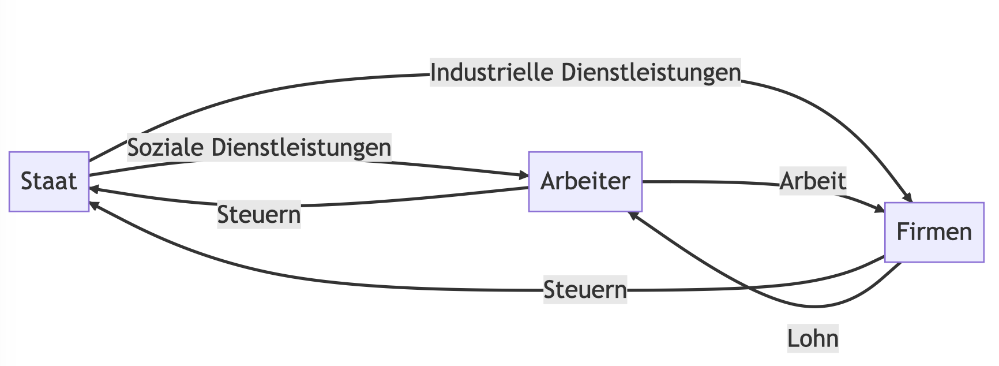
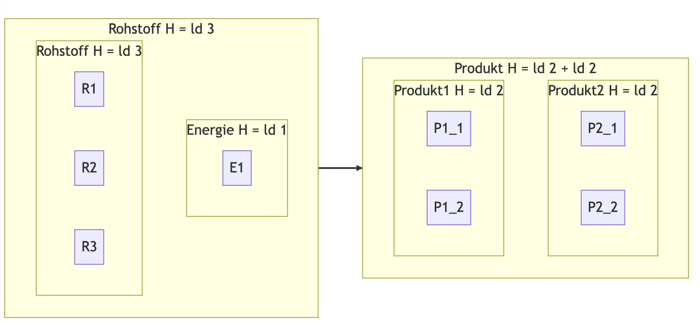
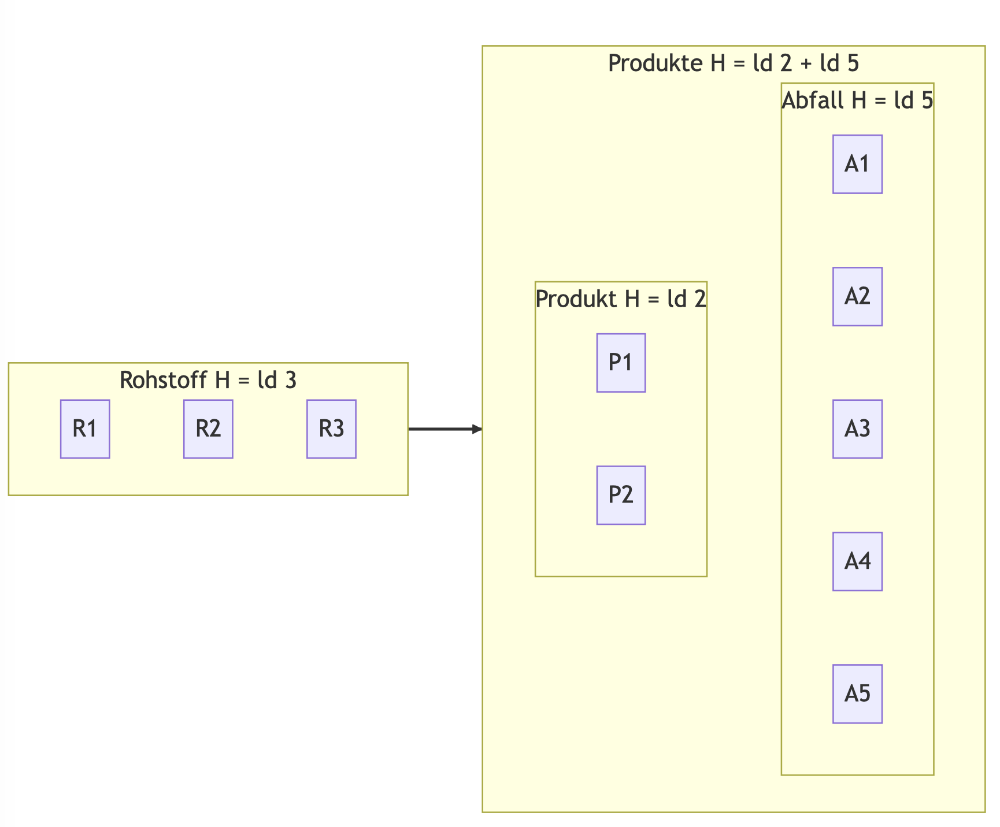

\begin{titlepage}
    \begin{center}
        \vspace*{1cm}

        \textbf{ENTROPIE EINES WIRTSCHAFTSSYSTEMS}
        \vspace{0.5cm}

        Modellierung
        \vspace{1.5cm}

        \textbf{Daniel Meiborg}
        \vfill

        SIA - Schüler-Ingenieur-Akademie

        \vspace{0.8cm}

        \includegraphics[width=\textwidth]{../logo-birklehof.jpg}
        \includegraphics[width=\textwidth]{../logo-sia.jpg}

        \vspace{0.8cm}

        Frau Dr. Hardung, Herr Dr. Itzen, Hr. Vogelgesang

        Schule Birklehof e.V.

        2022/2023
    \end{center}
\end{titlepage}

\newpage
\renewcommand{\contentsname}{Inhaltsverzeichnis}
\tableofcontents
\newpage

# Modellierung

## Einleitung

Die Gültigkeit des zweiten Hauptsatzes der Thermodynamik für physikalische
Prozesse ist allgemein anerkannt. Wie bereits im ersten Kapitel erläutert, lässt
sich dieser Satz auch allgemein für eine Gruppe von stochastischen Prozessen
beweisen. Aus diesem Grund ist es von Bedeutung, die Anwendbarkeit dieses so
grundlegenden Konzepts auf ökonomische Strukturen genauer zu untersuchen.

Eine grundlegende Methode der Wissenschaft besteht darin, komplexe Phänomene zu
vereinfachen und in mathematische Modelle zu überführen. In den
Wirtschaftswissenschaften gibt es zahlreiche Modelle, die dazu dienen,
wirtschaftliche Zusammenhänge abzubilden. Die in dieser Arbeit betrachteten und
entwickelten Modelle müssen daher den zweiten Hauptsatz der Thermodynamik
erfüllen. In diesem Kapitel werden dazu verschiedene Ansätze präsentiert.

## Ausgleichsterme

Die meisten der folgenden Modelle basieren auf die eine oder andere Weise auf
Markov-Prozessen. Ziel ist es, ein Modell so für den zugrundeliegenden
Sachverhalt zu erstellen, dass dieser Markov-Prozess den zweiten Hauptsatz der
Thermodynamik erfüllt. Nachdem das ein Spezialfall von Markov-Prozessen ist, ist
es unwahrscheinlich, dass der erste Versuch dieses Kriterium erfüllt. Aus diesem
Grund kann man Ausgleichsterme einführen. Diese dienen dazu, das Modell so
anzupassen, dass es sowohl die Realität als auch den zweiten Hauptsatz der
Thermodynamik erfüllt. Für physikalische Prozesse werden als negative
Entropiequelle (ein Teil eines Systems, dessen Entropie erhöht wird, um die
eines anderen zu verringern) häufig große Temperaturunterschiede wie z.B. in
einem Motor benutzt. Allgemein kann konkrete Information als solche betrachtet
werden. Weitere Beispiele dafür befinden sich im Abschnitt [Atomare
Operationen](#atomare-operationen).

## Agentenbasierter Markov-Prozess

Bei einem agentenbasierten Markov-Prozess versucht man, ökonomische Agenten
(Staat, Banken etc.) annähernd zu modellieren. Agenten sind hier im Sinne der
Spieltheorie als Entitäten, die mit ihrer Umwelt agieren können, zu verstehen.
Der erste Schritt ist hier das Verhalten einzelner Agenten z.B. mithilfe von
Entscheidungsdiagrammen (siehe [Beispiel](#beispiel)) in eine Form zu
übersetzen, die sich dann weiterverarbeiten lässt.

Im nächsten Schritt muss dieses Modell dann in einen Markov-Prozess umgewandelt
werden. Eine dazu vom Autor konzipierte und entwickelte Bibliothek ist
Entromatica [@meiborg2023entromatica].

Dieser Markov-Prozess lässt sich dann vergleichsweise einfach simulieren. Aus
der daraus zu berechnenden Entropie (siehe [Entropie](#entropie)) oder direkt
aus der Übergangswahrscheinlichkeitsmatrix kann man nun berechnen, ob der zweite
Hauptsatz der Thermodynamik gilt. Falls das nicht der Fall ist, muss man
dementsprechend man das Ausgangsmodell sukzessive anpassen.

### Entropie

Die Entropie wird hier anhand der Shannon-Entropie der möglichen Zustände
definiert. Die Wahrscheinlichkeitsverteilung $X_0$ ist zu Beginn bekannt, und
die Entropie wird als Funktion über die Zeit dargestellt. Diesem Prinzip folgen
auch alle anderen auf Markov-Prozessen basierenden hier vorgestellten Modelle.

### Beispiel

Im Folgenden ist ein Diagramm zu sehen, das vereinfacht mögliche Zustände eines
Kaufprozesses auf der Seite des Käufers und die jeweiligen
Übergangswahrscheinlichkeiten darstellt. ‘Stabil’ bezeichnet hier den
Ausgangszustand. In diesem Szenario entschließt sich der Agent von Zeit zu Zeit,
ein Produkt zu kaufen, und erfährt dabei ab und zu Betrug. Das führt dann dazu,
dass er für eine Zeit lang im Zustand ‘Abbruch’ feststeckt, d.h. aufgrund der
Betrugserfahrung vorsichtiger ist.




### Vorteile

Da ein tatsächliches Wirtschaftssystem ebenfalls aus einer Vielzahl an Agenten
besteht, hat dieses System das Potenzial, bei idealer Umsetzung gute Ergebnisse
zu liefern.

### Probleme

Dabei treten jedoch einige Probleme auf: Zunächst einmal ist die Modellierung
von menschlichen Agenten extrem aufwändig, schwierig oder schlicht unmöglich.
Auch bei sehr simplen Systemen muss eine Vielzahl an Parametern willkürlich
gesetzt werden, da die Datenlage und die Verarbeitungskapazität in der Regel
sehr limitiert sind. Des weiteren sind die Ausgleichsterme in Vergleich zu den
folgenden Ansätzen schwieriger zu implementieren, da sie erfordern, dass
entweder neue Agenten hinzukommen oder bisherige ihre Entscheidungen radikal
verändern, was die Aussagekraft des Modells weiter beeinträchtigt.

## Diffusionsbasierter Markov-Prozess

Das Vorgehen bei diffusionsbasierten Markov-Prozessen ist ähnlich wie bei
agentenbasierten Markov-Prozessen. Der Hauptunterschied besteht allerdings
darin, dass anstatt alle Agenten weitestgehend einzeln zu modellieren, lediglich
grobkörnig die Flüsse von Kapital bzw. Ressourcen angegeben werden. Der Begriff
‘Diffusion’ ist hier insofern zu verstehen, als dass Dienstleistungen oder
Produkte i.d.R. eine Form von Gegenleistung bedingen und Kapital bzw. Ressourcen
so zwischen verschiedenen Agenten diffundieren.

### Beispiel

In diesem Diagramm sind schematische Beziehungen zwischen ökonomischen
Entitäten zu sehen. Im nächsten Schritt müssen hier Wahrscheinlichkeiten für
Diffusion und Quantitäten angegeben werden.



### Vorteile

Ein wesentlicher Vorteil dieses Ansatzes ist, dass Entscheidungen von Agenten
von Anfang an als nicht vorhersagbar angenommen werden. Tatsächlich ist diese
Unvorhersagbarkeit hier hilfreich, da Zufall für Markov-Prozesse ein
essentielles Element ist. Stattdessen werden lediglich die größeren
Zusammenhänge beachtet.

### Probleme

Allerdings kann bei dem Versuch, das Wirtschaftssystem auf einer niedrigeren
Ebene zu modellieren, dieses Konzept in eine kompliziertere Version der
agentenbasierten Version ausarten. Es muss also immer zwischen den beiden
Ansätzen abgewogen werden.

## Entropiebasiertes Wirtschaftssystem

Der nächste Ansatz besteht darin, lediglich diejenigen Teile der Wirtschaft zu
betrachten, die sich  selbst mit Wahrscheinlichkeiten beschäftigen. Dieses
breite Feld umfasst alles von Versicherungen, Glücksspiel bis hin zu
Kryptowährungen. Hier können sowohl reale Systeme betrachtet werden als auch
fiktive Wirtschaftssysteme, in denen beispielsweise reine Information eine
Währung ist.

### Beispiel

Ein Beispiel dafür ist ein virtuelles Pferderennen: In diesem ist die einzige
Information, die das ansonsten geschlossene System (z.B. einen Computer)
verlässt, der (eindeutige) Gewinner. Bei 8 Pferden sind das 3 Bit Information.
Vor Beginn des Zufallsexperiments gibt es also 3 Bit Ungewissheit; danach sind
es 0 Bit (auf das Pferderennen bezogen). Nun kann man einen Markov-Prozess aus
dem Pferderennen und Umgebung erstellen. Um diesen nach dem zweiten Hauptsatz zu
modellieren (der, unseres Wissens nach, auf die Physik zutrifft), muss diese
Pferderennen-Simulation dabei mindestens an 3 Bit Entropie zunehmen. Anhand des
Landauer-Prinzips lässt sich ein Minimum an Energie festlegen, welches benötigt
wird, um ein einzelnes Bit zu löschen. Dieses Minimum wird nach Landauer
[@landauer1961limit] mithilfe folgender Formel berechnet: $E = k_BT\ln(2)$,
wobei $k_B$ der Boltzmann-Konstante entspricht. Ein Bit entspricht bei
Raumtemperatur also mindestens $E = k_B \cdot 295K \cdot \text{ln}(2) \approx
2,823 \cdot 10^{-21}J$ und die 3 Bit etwa $2,823 \cdot 10^{-21}J \cdot 3 \approx
8,469 \cdot 10^{-21}J$, die in Wärme konvertiert werden müssen. Bei einem Preis
von etwa $0,33 \frac{€}{\text{kWh}}$ 2022 in Deutschland
[@destatis2022electricity] sind das etwa $8,469 \cdot 10^{-21}J \cdot 0,33 \cdot
3,6 \cdot 10^{-6} \frac{€}{J} \approx 10^{-26}€$, die der Ausgang mindestens
wert ist. So könnte man in einer Gesellschaft prinzipiell Information als
tatsächlichen Wertgegenstand einsetzen.

### Vorteile

Da die Branche direkt an Wahrscheinlichkeiten orientiert ist, hat der Begriff
der Entropie hier mehr Aussagekraft als bei den generischen agenten- oder
diffusionsbasierten Modellen.

### Probleme

Allerdings wird für reelle Wirtschaftszweige deutlich, dass die Entropie, die
man bei der Spekulation erhält, in aller Regel nicht dem entspricht, was eine
solche Berechnung ergeben würde, da solche Systeme nicht vollständig
abgeschlossen sind und Information nach außen dringen kann.

## Markup-Sprache

Während die bisherigen Modellierungsmöglichkeiten darauf beruhen, ein bestimmtes
Wirtschaftssystem zu modellieren und dessen Entropie zu berechnen, wird bei
diesem Ansatz gewissermaßen die Entropie aller möglichen Wirtschaftssysteme
berechnet.

Im ersten Schritt wird dazu eine Markup-Sprache definiert. Das kann
beispielsweise ein XML-Dialekt sein. Diese Syntax wird dazu verwendet, ein
bestimmtes System zu beschreiben.

Es ist wichtig zu beachten, dass zunächst nur der Informationsgehalt, nicht die
Entropie dieses Dokuments berechnet wird. Dazu wählt man eine gewisse Länge für
die Dokumente oder begrenzt die Anzahl anderweitig. Danach weist man jedem
dieser Dokumente eine Wahrscheinlichkeit zu. Das kann jeweils die gleiche sein
oder komplexere Ansätze wie in [Evolutionäre
Algorithmen](#evolutionäre-algorithmen) illustriert. Diese Wahrscheinlichkeit
lässt sich, wie in den theoretischen Grundlagen erläutert, dann in den
Informationsgehalt umwandeln. Schließlich kann man für die ganze Menge der
Dokumente die Entropie berechnen.

### Beispiel

Im Folgenden ist eine mögliche Darstellung eines aus drei Agenten bestehenden
Systems in einem frei erfundenen XML-Dialekt zu sehen.

```xml
<economy>
  <agents>
    <agent id="A1" type="producer" />
    <agent id="A2" type="consumer" />
    <agent id="A3" type="producer" />
  </agents>
  <products>
    <product id="P1" producer="A1" />
    <product id="P2" producer="A3" />
  </products>
  <connections>
    <connection type="trade" producer="A1" consumer="A2"
			product="P1" quantity="50" price="10" />
    <connection type="trade" producer="A3" consumer="A2"
			product="P2" quantity="25" price="5" />
    <connection type="loan" lender="A2" borrower="A3"
			amount="100" interest_rate="0.05" />
  </connections>
</economy>
```

### Evolutionäre Algorithmen

Optional kann man den so berechneten beispielsweise Informationsgehalt mit
evolutionären Algorithmen kombinieren, um eine Veränderung der
Wahrscheinlichkeiten über die Zeit zu erhalten. Hier würde man verschiedene
solcher Systeme mutieren lassen und die Veränderung der Entropie betrachten. Da
zu Beginn alle möglichen Systeme als gleich wahrscheinlich angenommen werden,
sinkt demnach die Entropie, wenn sich einzelne Wirtschaftssysteme als effektiver
herausstellen. Wie in dem Beispiel für entropiebasierte Wirtschaftssysteme
illustriert, lässt sich daraus auch die Menge an Information bzw. Energie
berechnen, die dafür aufgewendet werden muss. Voraussetzung dafür ist
allerdings, dass man eine Funktion definieren kann, die die Effektivität eines
Wirtschaftssystems berechnet.

### Vorteile

Der wesentliche Vorteil hier ist, dass man die Entropie der *Struktur* der
Wirtschaftssysteme berechnen kann, anstatt die Entropie ihres Verhaltens.
Dadurch muss man nicht den schwierigen Schritt gehen und die einzelnen Agenten
simulieren.

### Probleme

Allerdings kann ohne weitere Modifikationen der 2. Hauptsatz der Thermodynamik
nicht angewendet werden, da die Dokumente kein Markov-Prozess sind. Ein Ansatz,
dieses Problem zu umgehen, besteht in evolutionären Algorithmen.

## Atomare Operationen

Im Gegensatz zu den bisherigen Modellen werden hier Prozesse auf einer möglichst
niedrigen Ebene betrachtet. Anstatt die Struktur eines Wirtschaftssystems zu
analysieren, versucht man, einfache ökonomische Prozesse mit Markov-Prozessen zu
modellieren. ‘Atomar’ ist hier nicht im Sinne der Kernphysik zu verstehen,
sondern vielmehr als *unteilbare* Handlungen.

### Beispiel

Eine solche atomare Operation könnte zum Beispiel die Produktion von Gütern aus
Rohstoffen sein. In dem folgenden Diagramm kann man einen solchen Prozess sehen.
Es gibt in diesem Markov-Prozess zwei Gruppen von Zuständen: *Rohstoff* und
*Produkt*. Zum Zeitpunkt $t=0$ ist unbekannt, welcher der drei möglichen
Zustände R1, R2 oder R3 von dem Rohstoff tatsächlich eingenommen wird, d.h. alle
haben eine Wahrscheinlichkeit von $\frac{1}{3}$ und damit die Entropie $H(X_0) =
\text{ld}(3)$. Zum Zeitpunkt $t=1$ wechseln diese Zustände zufällig entweder zu
P1 oder P2. Die Entropie ist somit $H(X_0) = \text{ld}(2) = 1 \text{bit}$.


Um den zweiten Hauptsatz der Thermodynamik zu erfüllen, kann man nun das Modell
auf mehrere Arten erweitern. Eine solche Möglichkeit ist die Einführung von
Energie als Edukt (z.B. in Form von Photonen). Hier ist es wichtig zu beachten,
dass R1, R2, R3 und E1 keine getrennten Zustände sind, die die Edukte einnehmen
können, sondern ein konkreter Zustand des Markov-Prozesses aus der Kombination
(R1, E1), (R2, E1) oder (R3, E1) besteht. Dementsprechend bleibt die
Gesamtentropie von $X_0$ gleich. Basis für die Annahme der geringen Anzahl an
Zuständen der ‘Energie’ ist, dass es weniger Zustände beispielsweise für
Photonen gibt (um genau zu sein $H = k(1-\ln(f_r))$; $f_r$ entspricht der
Photonenverteilung und $k$ der Boltzmann-Konstante [@kirwan2004photons]) als für
eine bestimmte Menge z.B. eines idealen Gases. Die Zugabe von Energie bedingt
i.d.R. eine höhere Quantität an Produkten. In diesem Beispiel wird angenommen,
dass sich die Anzahl an Produktteilen dadurch verdoppelt. Da es für einen
einzelnen Teil bereits 2 Zustände gibt, gibt es für den Komplex aus beiden somit
4 mögliche Zustände: (P1_1, P2_1), (P1_1, P2_2), (P1_2, P2_1), (P1_2, P2_2). Die
Entropie beträgt damit $H(X_1) = \text{ld}(4) = 2 \text{bit}$.



Eine andere Möglichkeit ist Abfall. Dabei wird angenommen, dass bei der
Produktion eine gewisse Menge an undefinierbarem Abfall entsteht. Undefinierbar
meint hier, dass man bei der Produktion nicht darauf achtet, eine bestimmte Art
von Abfall zu produzieren, sondern der Abfall irgendetwas sein kann. Somit hat
dieser hier eine hohe Anzahl an möglichen Zuständen (willkürlich gewählt 5). Das
Entropieverhältnis ist hier also $H(X_0) = \text{ld}(3) \approx 1,585
\text{bit}$ und $H(X_1) = \text{ld}(2 \cdot 5) = \text{ld}(2) + \text{ld}(5)
\approx 3,322 \text{bit}$.



### Vorteile

Im Gegensatz zu den anderen Modellen ist dieser Ansatz vergleichsweise
anschaulich und nachvollziehbar. Des Weiteren muss man dazu nicht das Verhalten
von Agenten voraussagen, was die Umsetzbarkeit dramatisch erhöht.

### Probleme

Allerdings wächst die Komplexität dieses Ansatzes bei Betrachtung eines größeren
Systems immens. Hier verschwimmen die Grenzen zu den ersten beiden Modellen.

## Fazit

Agenten- und diffusionsbasierte Modelle sind also geeignet, um die Entropie des
Verhaltens eines einzelnen Wirtschaftssystems zu analysieren. Für den Vergleich
der Struktur hingegen ist eine Markup-Sprache eher geeignet. Mit atomaren
Operationen kann man ökonomische Prozesse auf einer niedrigeren Ebene
betrachten.

Agenten- und diffusionsbasierte Modelle bieten geeignete Ansätze, um die
Entropie des Verhaltens eines einzelnen Wirtschaftssystems zu analysieren und
ökonomische Prozesse auf einer höheren Ebene zu betrachten. Jedoch sind diese
Modelle aufgrund ihrer Komplexität schwer zu interpretieren und zu skalieren.
Für den Vergleich der Struktur eines Wirtschaftssystems ist hingegen eine
Markup-Sprache eher geeignet, da dabei die Agenten nicht simuliert werden
müssen. Schließlich ermöglichen atomare Operationen, ökonomische Prozesse auf
einer niedrigeren Ebene zu betrachten.

Zusammenfassend kann gesagt werden, dass das Thema der Entropie in einem
Wirtschaftssystem ein interdisziplinärer Ansatz ist, der die Verbindung von
naturwissenschaftlichen und gesellschaftswissenschaftlichen Konzepten aufzeigt.
Die Anwendung des zweiten Hauptsatzes der Thermodynamik auf ökonomische Modelle
ermöglicht es, komplexe Prozesse in einem Wirtschaftssystem besser zu verstehen
und zu erklären. Die vorgestellten Ansätze bieten dabei unterschiedliche
Möglichkeiten der Modellierung, welche jeweils eigene Vor- und Nachteile
aufweisen.

## Ausblick

Die vorgestellten Ansätze zur Entropieanalyse in Wirtschaftssystemen bieten
vielversprechende Möglichkeiten für weitere Forschung. Ein vielversprechender
nächster Schritt wäre die weitere Entwicklung und Umsetzung atomarer
Operationen.

Eine weitere Möglichkeit zur Weiterentwicklung wäre die Weiterentwicklung des
Konzepts der Anwendung von evolutionären Algorithmen bei Markup-Sprachen.

## Quellen